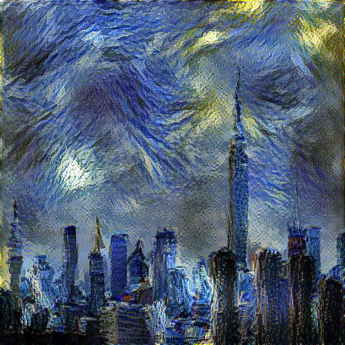
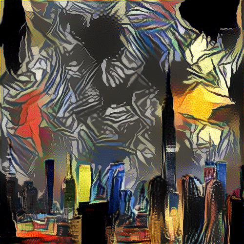
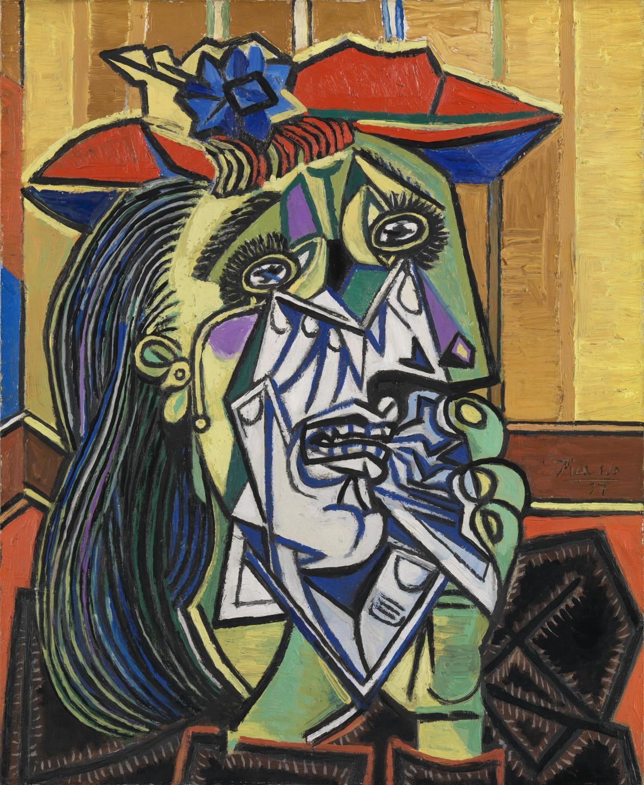
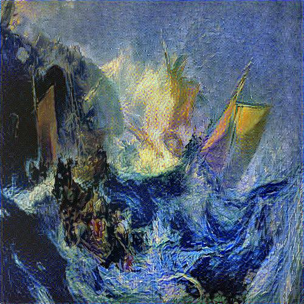
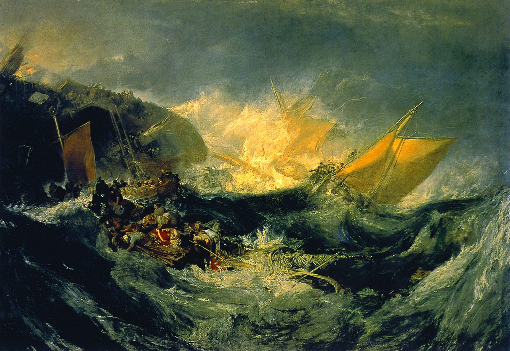

# neural-style

This is an implemantation of [paper] by Leon A. Gatsy, Alexander S. Ecker, Matthias Bethge in Tensorflow.

## Running

`python neuralstyle.py <style file> <content file> --output <output file>`

Run `python neuralstyle.py --help` to see a list of all options.

## Examples

The following image was run for 2,000 iterations with default parameters:

Input images:

Another example where `--weight-content 0.01` and `--weight-style 1.0e4` were used:

The same city skyline image was used and this painting by Picasso.

Final example two painting were used with `--weight-content 0.09` and `--weight-style 1.5e4`:

With inputs:

## Dependencies

The Python dependencies can be installed by using `pip install -r requirements.txt`

[paper]: https://arxiv.org/abs/1508.06576